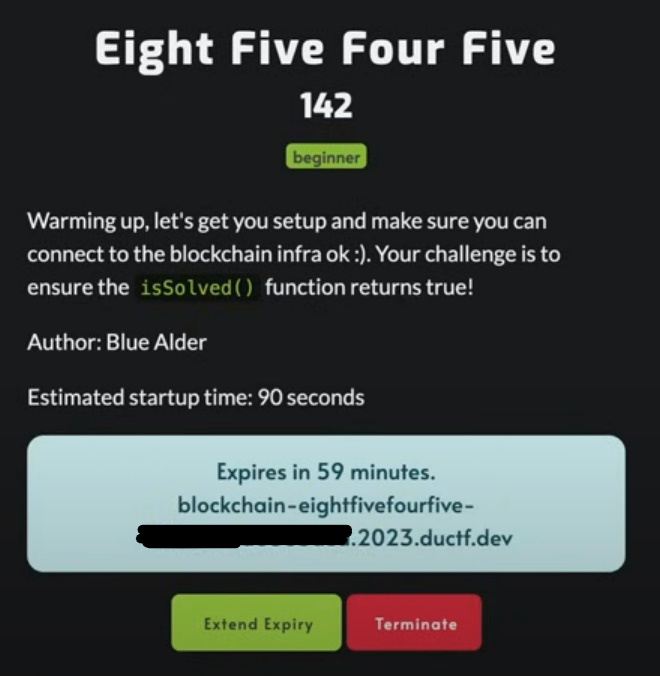
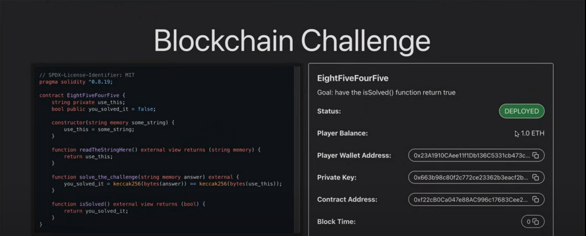

# EghitFiveFourFive

Hello everyone.

In this write-up, we will see how to solve the challenge called **"EightFiveFourFive"** which was one of the challenges of **DownUnderCTF 2023** under the BLockchain category. This challenge involves a Solidity smart contract which we should interact with to solve the challenge. Below is the step-by-step explanation of it's solution:

## Step 1 - Understanding the challenge

As mentioned above, this challenge involves a Solidity smart contract which is pretty simple and to solve the challenge, we should interact with it. Based on the description of the challenge, we have to make one of the functions in the contract's code called **"isSolved"** to return the value **"true"**

You can see the description of the challenge in the image below:

As you can see when you start the challenge it will create a private Ethereum blockchain for you and provide you with a link that contains the information you need to interact with your instance of the contract. This info contains the contract address, wallet address, private key, RPC URL and chain ID.

## Step 2 - Understanding the contract's code

The source code of the smart contract involved in the challenge is provided below:

`
// SPDX-License-Identifier: MIT pragma solidity ^0.8.19;
contract EightFiveFourFive {
string private use_this;
bool public you_solved_it = false;

    constructor(string memory some_string) {
        use_this = some_string;

        function readTheStringHere() external view returns (string memory) {
            return use_this;
        }
        function solve_the_challenge (string memory answer) external {
            you_solved_it = keccak256(bytes(answer)) == keccak256(bytes(use_this));
        }
        function isSolved() external view returns (bool) {
            return you_solved_it;
        }
    }

}
`

As you can see this contract is named **"EightFiveFourFive"** and it has these functions in it:

- readTheStringHer
- solve_the_challenge
- isSolved

Also, if you look at the constructor you see that it takes an argument of type String called **"some_string"** and initializes a private variable declared in the code called **"use_this"** with it.

## Step 3 - Understand the logic of the code

Now, remember what is required to solve the challenge. Exactly, we have to make the **"isSolved"** function return "true". Looking at this function it turns out that it returns the value of a variable called **"you_solved_it"** which is also declared in the code and its default value is **"false"** (No surprisingly!). So to make the **"isSolved"** function return **"true"**, we have to somehow manipulate the value of the **"you_solved_it"** variable and change it to **"true"**. Since this variable is private, we can't directly change it's value. So we have to find something else that we can access from the outside and it has access to the **"you_solved_it"** variable.

If you look at the **"solve_the_challenge"** function, you see that it has access to the "you_solved_it" variable and it also manipulates its value once it gets called. So if we can find out how this function is manipulating the value of the **"you_solved_it"** variable, maybe we can use it to change its value to **"true"**.

Looking at this function, it turns out it compares two values with each other and assigns the result of this comparison (which can be true or false) to the **"you_solved_it"** variable. It means we have to make the result of this comparison to be **"true"**. The comparison is: **keccak256(bytes (answer)) == keccak256(bytes (use_this))**

It seems that the **"solve_the_challenge"** function takes an argument of type String called **"answer"** and will calculate some sort of hash for it and then it compares this hash value with the same kind of hash calculated for the **"use_this"** and if these two values are equal, it will assign the value **"true"** to the **"you_solved_it"** variable (Just the thing we want!). Well, we have control over the value of the **"answer"** variable but we don't know what the value of the **"use_this"** variable is. So we have to somehow find the value of the **"use_this"** variable and then use it as the **"answer"** argument when calling the **"solve_the_challenge"** function.

Looking at the code again, we see there is another function called **"readTheStringHere"**" that exactly does what we want and it returns the value of the **""use_this"**" variable. Also notice that it's an external function, meaning we can call it from the outside.

With all these in mind here is what we should do to solve the challenge:

1. Interact with the contract and call the "readTheStringHere" function to extract the value of the "use_this" variable.

2. Call the "solve_the_challenge" function and use the value of the "use_this" variable as the "answer" argument when calling it.

3. Call the "isSolved" function to make sure that it returns the value "true"

## Step 4 - Solve the challenge!

Now, there are lots of ways to interact with a deployed smart contract and call its functions. Maybe a convenient way is to use the **"web3.py"** library to do this, but I prefer working with the "Remix" IDE in this case because it's just easier! **"Remix"** is an online IDE for developing, deploying and playing around with smart contracts and we will use it to interact with the contract involved in this challenge and do the steps mentioned above. To use **"Remix"** to solve the challenge, we also have to work with "Metamask" which is a popular cryptocurrency wallet and it also has a Chrome extension to work with it.

So, first, we have to install the **"Metamask"** Chrome extension and create an account. Once we do that, we have to connect our wallet address which was provided in the link given in the challenge description. We do that so we can later connect our Metamask wallet to the Remix and from there we can interact with the contract with our wallet address which has 1 test ETH in it to cover the fee of the transactions we perform in the test net.

Follow these steps in Metamask to connect to your private blockchain and connect your wallet to it:

1. Open Metamask extension.

2. On top, click on "Select a network"

3. Scroll down until you see the option "Add a network"

4. On the new page, click on "Add a network manually"

5. Fill the "New RPC URL" with the RPC URL given in the link provided in the challenge description and it should fill the "Currency symbol" and "Network name" fields automatically.

6. Fill the "Chain ID" field with the chain ID provided in the link and click on "Save".

Now using this information the Metamask should detect the network that the contract has deployed on it and it should add it to the list of your networks.

7. Select and connect to this new network by clicking on its name in the "Select a network" section

8. Once you are connected to the new network, click on your account's name, then click on "Import account".

9. In the "Enter your private key string here:" field, paste your private key provided in the link and click on "Import".

Now your wallet with the same wallet address as provided in the link should be connected to the Metamask and if you are connected to the challenge's network, it should display the balance of 1 ETH for you which is the 1 ETH that the challenge gives you to cover the transaction fee.

Now that you successfully imported your wallet into Metamask and connected to the challenge's network, you can connect your Metamask to the Remix to interact with the contract and call its functions.

Here are the steps you should follow:

1. Open Remix at [title](https://remix.ethereum.org)

2. Under the **"FILE EXPLORER"** tab create a new file called **"EightFiveFourFive.sol"** and paste the smart contract source code in it.

3. Compile the code using the **"SOLIDITY COMPILER"** tab.

4. Once you compiled it, go to the **"DEPLOY & RUN TRANSACTIONS"** section.

5. On top and under **"ENVIRONMENT"**, click on the dropdown menu and select the **"Injected Provider - MetaMask"** option.

6. Once you do that, the Metamask extension should automatically detect it and require you to approve the connection.

Once you approve the connection you should see the chain ID below the dropdown menu and it indicates that you have successfully connected your wallet with Remix.

7. Now, if you have compiled the source code, you should see the name of your file (which is **"EightFiveFourFive"** in this case) under **"Contracts"**. Click on it's name and then you can see a blue button named **"At address"** with an empty text box next to it. Paste the contract address in the link in that text box and click on the **"At address"** button.

What you do here is you tell the Remix to generate the contract ABI from the source code you compiled and then connect with this an instance of this contract that is deployed in the address you provided (the address that your instance of the challenge's contract has deployed on it).

8. Once you do that, you should see your contract under the **"Deployed Contracts"** section. Click on it and it will show you the contract name, contract address (same as the address you provided) and an interface to interact with the contract's function.

Here you can see all the public functions and variables of the contract and you can call those functions or retrieve the value of the variables.

9. To solve the challenge, Call the **"readTheStringHere"** function and it gives you the value that is used to initialize the **"use_this"** variable once the contract has deployed. You see that this value is **"I can connect to the blockchain!"**

10. Call the **"solve_the_challenge"** function and use the value above as the value of the **"answer"** argument.

11. Call the **"solved"** function and observe it return the value **"true"** indicating that the challenge is solved!

12. Now get back to the link that the challenge provided you and click on **"get the flag"** and you see that the flag is displayed for you.

Finally, Submit the flag and enjoy!
