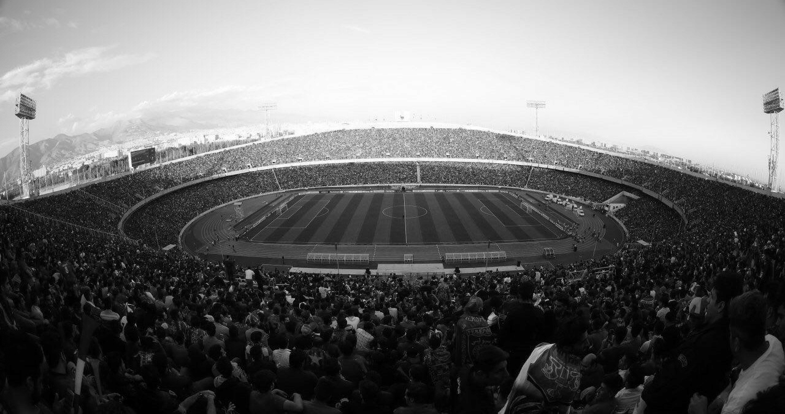

# Bit ✈️

توی این سوال به ما فقط یه عکس داده شده و توی راهنمایی سوال گفته شده فلگ یه جایی توی عکس قرار داره

```
Bit ✈️

Points: 100

Assets: Yes

The flag is somewhere in the image.

Can you find it
```

فایل یه عکس از استودیوی آزادیه



با `exiftools` متادیتای عکس رو چک میکنیم شاید اونجا چیزی در مورد فلگ پیدا کنیم

`$ exiftool Azadi_Stadium_ACL_2018.png`

```
ExifTool Version Number         : 12.50
File Name                       : Azadi_Stadium_ACL_2018.png
Directory                       : .
File Size                       : 378 kB
File Modification Date/Time     : 2023:04:06 19:47:18+03:30
File Access Date/Time           : 2023:04:12 19:00:07+03:30
File Inode Change Date/Time     : 2023:04:06 20:28:18+03:30
File Permissions                : -rw-r--r--
File Type                       : PNG
File Type Extension             : png
MIME Type                       : image/png
Image Width                     : 1280
Image Height                    : 675
Bit Depth                       : 8
Color Type                      : Grayscale
Compression                     : Deflate/Inflate
Filter                          : Adaptive
Interlace                       : Noninterlaced
Image Size                      : 1280x675
Megapixels                      : 0.864
```

هیچ چیز عجیبی توی متادیتای عکس وجود نداره.

توی اسم سوال عکس یه هواپیما وجود داره که یکمی عجیبه و ممکنه راهنمایی باشه و بعد از گشتن به [این صفحه](https://en.wikipedia.org/wiki/Bit_plane) میرسیم

میتونیم برای بررسی bitplane ها از ابزار [zsteg](https://github.com/zed-0xff/zsteg) استفاده کنیم

`$ zsteg -a Azadi_Stadium_ACL_2018.png`

```
imagedata           .. file: amd 29k coff noprebar executable
b2,r,msb,xy         .. text: ["U" repeated 10 times]
b2,rgb,msb,xy       .. text: "TUUUUUUUU"
b4,r,lsb,xy         .. text: "\"\"$\"\"$DDFfffh"
b4,r,msb,xy         .. text: "UUUU3333www"
b4,rgb,lsb,xy       .. text: "\"#3\"\"\"DDDDDDfffffffff"
b4,rgb,msb,xy       .. text: "DDD\"\"\"\"\"\"fffffffff"
b6,r,msb,xy         .. text: "EQTUUUUU5M"
b6,rgb,msb,xy       .. text: "EUUUUUUUUUUUUUUUUUU"
b8,r,msb,xy         .. text: "II))))iiiiii"
b8,rgb,lsb,xy       .. file: MGR bitmap, old format, 1-bit deep, 16-bit aligned
b8,rgb,msb,xy       .. text: "QQQQQQ111"
b2,r,msb,xy,prime   .. text: "PU@UTEEA"
b2,rgb,lsb,xy,prime .. file: VISX image file
b2,rgb,msb,xy,prime .. text: "TUUU@UUU"
b4,r,lsb,xy,prime   .. text: "\"\"\"DDDDDD\"\""
b4,r,msb,xy,prime   .. text: "$$fQ53@D\""
b4,rgb,lsb,xy,prime .. text: "\"$D\"$Dfff"
b4,rgb,msb,xy,prime .. text: "D$\"D$\"fff"
b6,rgb,msb,xy,prime .. text: "eEQTUUUU"
b8,r,msb,xy,prime   .. text: "UU555\rMMM--m"
b8,rgb,msb,xy,prime .. text: "III)))iii"
b1,r,lsb,yx         .. text: "A bit plane of a digital discrete signal (such as image or sound) is a set of bits corresponding to a given bit position in each of the binary numbers representing the signal. For example, for 16-bit data representation there are 16 bit planes: the first b"
b4,r,lsb,yx         .. text: "6uFE4DEgvwv"
```

اینجا همون متنی که توی wikipedia دیدیم رو دوباره میبینیم ولی کامل نشون داده نشده برای اینکه کلشو ببینیم از دستور زیر استفاده میکنیم

 `$ zsteg -E b1,r,lsb,yx Azadi_Stadium_ACL_2018.png`

```
A bit plane of a digital discrete signal (such as image or sound) is a set of bits corresponding to a given bit position
in each of the binary numbers representing the signal. For example, for 16-bit data representation there are 16 bit 
planes: the first bit plane contains the set of the most significant bit, and the 16th contains the least significant 
bit. queraCTF{u$eFu1_bIt_P1aN3} It is possible to see that the first bit plane gives the roughest but the most critical
approximation of values of a medium, and the higher the number of the bit plane, the less is its contribution to the 
final stage. Thus, adding a bit plane gives a better approximation. If a bit on the nth bit plane on an m-bit dataset 
is set to 1, it contributes a value of 2^m-n, otherwise it contributes nothing. Therefore, bit planes can contribute 
half of the value of the previous bit plane. Bit plane is sometimes used as synonymous to Bitmap; however, technically
the former refers to the location of the data in memory and the latter to the data itself. One aspect of using bit-
planes is determining whether a bit-plane is random noise or contains significant information. One method for 
calculating this is to compare each pixel (X, Y) to three adjacent pixels (X - 1, Y), (X, Y - 1) and (X - 1, Y - 1).
If the pixel is the same as at least two of the three adjacent pixels, it is not noise. A noisy bit-plane will have 
49% to 51% pixels that are noise.%
```

flag: `queraCTF{u$eFu1_bIt_P1aN3}`